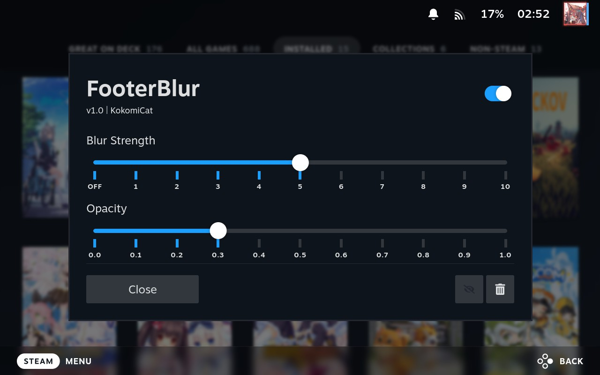
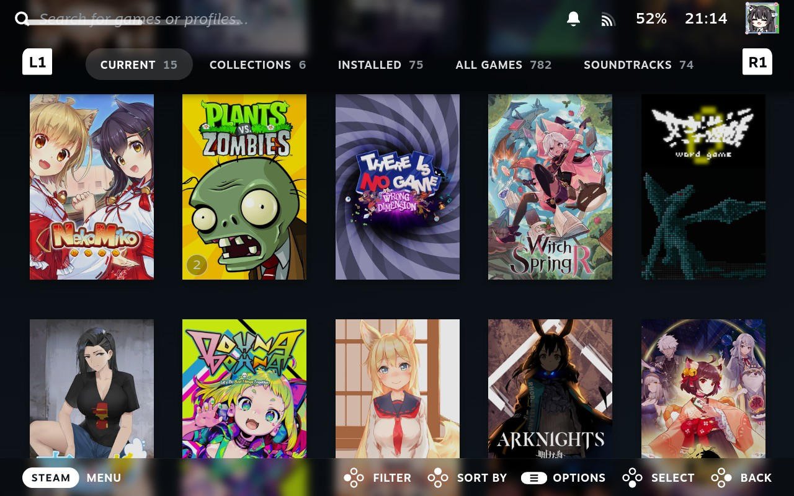
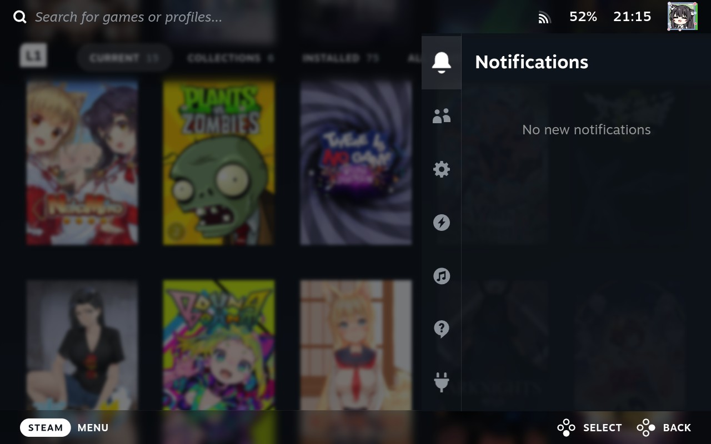
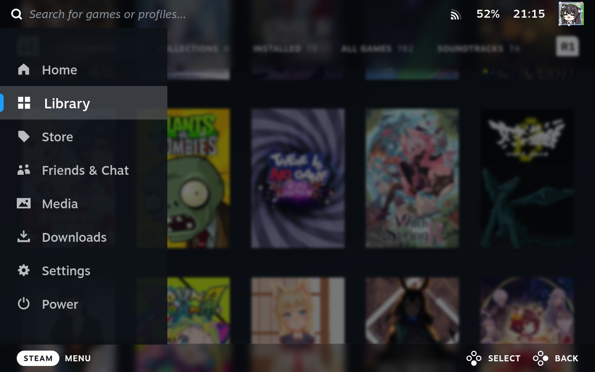
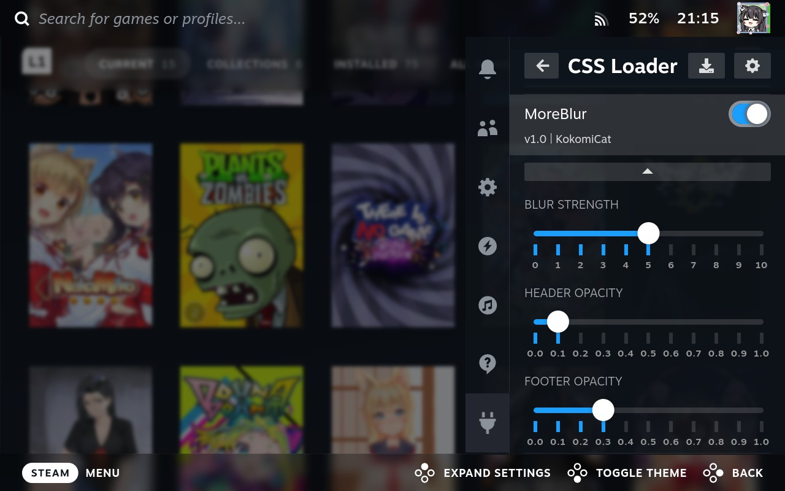

# FooterBlur

This theme applies a blur effect to the footer area, without clipping the boot animation.

## Screenshots

## Acknowledgements

This theme was created using resources and inspiration from the following sources:

- [DellyFooter](https://github.com/Dellyare/DellyThemes/tree/main/DellyFooter)

- [Footer Editor](https://github.com/GrodanBool/Steam-Deck-Tweak-Footer-Editor)

- [Stylish Footer](https://github.com/Tormak9970/SteamDeckThemes)

- [Better Blur](https://github.com/the-bukkit/Steam-Deck-Theme-Better-Blur)

# MoreBlur

This theme applies a blur (or transparent) effect to the header, footer, main menu, QAM, plus a simplest volume popin.

## Screenshots

## Acknowledgements

This theme was created using resources and inspiration from the following sources:

- [DellyFooter](https://github.com/Dellyare/DellyThemes/tree/main/DellyFooter)

- [Footer Editor](https://github.com/GrodanBool/Steam-Deck-Tweak-Footer-Editor)

- [Stylish Footer](https://github.com/Tormak9970/SteamDeckThemes)

- [Better Blur](https://github.com/the-bukkit/Steam-Deck-Theme-Better-Blur)

- [TopBarHoverBlur](https://github.com/Sendaford/Css-Loader-Themes)

- [DellyVolume](https://github.com/Dellyare/DellyThemes)

- [CapyMenuQAM](https://github.com/Kalyvara/sd-cssLoader-CapyMenuQAM)
